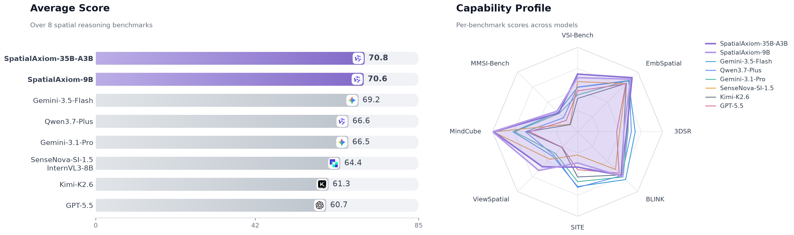
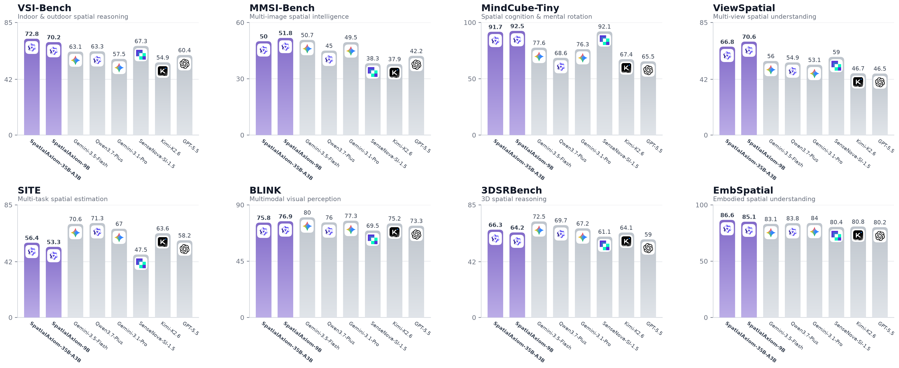

<p align="center">
  
</p>

<p align="center">
  <a href="https://d2i-ai.github.io/SpatialAxiom"></a>
  <a href="https://huggingface.co/SpatialAxiom/SpatialAxiom-9B"></a>
  <a href="https://huggingface.co/SpatialAxiom/SpatialAxiom-35B-A3B"></a>
</p>


We are thrilled to release **SpatialAxiom**, an open spatial intelligence model for general spatial reasoning. We release two open-weight models: **SpatialAxiom-9B**, a compact dense model, and **SpatialAxiom-35B-A3B**, a mixture-of-experts model with 3B active parameters.




- 🏆 **Leading spatial reasoning**: On average, our models surpass proprietary models and larger open-source alternatives, with leading results on VSI-Bench, MMSI-Bench, MindCube, ViewSpatial, and EmbSpatial.

- 🧪 **Spatial data-centric training recipe**: A systematic taxonomy of spatial tasks, balanced task distribution, and data synthesis to raise data quality. SpatialAxiom is trained purely with full-parameter SFT and serves as a clean starting point for downstream fine-tuning or RL.

- 🧩 **Qwen3.5 VLM backbone**: Inherits the Qwen3.5 vision-language model architecture, preserving a general-purpose multimodal design without task-specific architectural modifications.

- 🤗 **Open-weight release**: SpatialAxiom-9B and SpatialAxiom-35B-A3B are publicly released on Hugging Face, compatible with `transformers` and `vLLM` out of the box.



<p align="center"><em>SpatialAxiom performance across eight spatial reasoning benchmarks</em></p>


## 📰 News

* **[2026-07-31]** 🤗 **Model Release**: We are excited to release the weights for [SpatialAxiom-9B](https://huggingface.co/SpatialAxiom/SpatialAxiom-9B) and [SpatialAxiom-35B-A3B](https://huggingface.co/SpatialAxiom/SpatialAxiom-35B-A3B) on Hugging Face.


## 📚 Citation

If you find our work helpful, please consider giving us a cite.

```bibtex
@misc{spatialaxiom,
    title  = {SpatialAxiom: An Open Spatial Intelligence Model for General Spatial Reasoning},
    author = {Lou, Yujing and Chen, Pingyi and Cao, Shen and Gu, Jiaqi and Guo, Jinhui and Tong, Jintao and Hao, Yunzhuo and Liu, Yao and Fan, Lubin and Wu, Yue and Ye, Jieping},
    month  = {July},
    year   = {2026},
    url    = {https://d2i-ai.github.io/SpatialAxiom}
}
```

## ⚖️ License

SpatialAxiom developed by Alibaba and licensed under the CC BY-NC 4.0.

